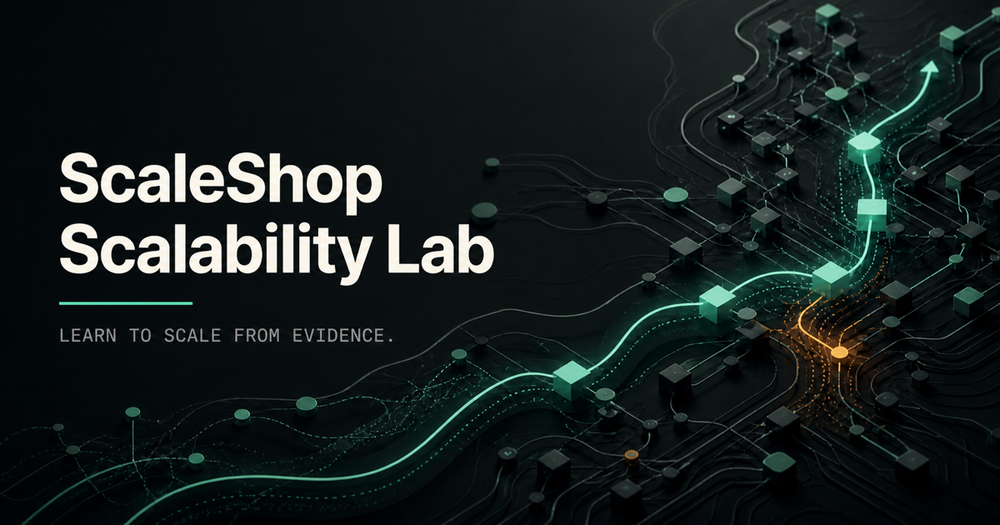

# ScaleShop Scalability Lab

> **Author:** [Ghassan Al Hamoud](https://ghassan-alhamoud.com)

ScaleShop is an evidence-driven interactive workshop for practicing scalability decisions. Participants investigate telemetry, form a diagnosis, cite decisive evidence, choose the smallest sufficient intervention, and compare their modeled outcome with a recommended reference architecture.



## Why This Exists

Scalability is rarely solved by selecting the most powerful technology. It is solved by identifying the current constraint, protecting invariants, and accepting only the complexity the evidence justifies.

The lab turns that reasoning process into twelve progressive incidents covering:

- observability and capacity envelopes
- database query behavior and caching
- asynchronous side effects and horizontal scaling
- geographic latency, read replicas, and analytical workloads
- service isolation, concurrency control, and data lifecycle management
- resilience under compound dependency, zone, and deployment failures

## How The Workshop Works

Each level follows the same loop:

1. Inspect the current architecture and operating constraints.
2. Explore telemetry and reveal evidence.
3. State a bottleneck hypothesis and cite the decisive signals.
4. Select an intervention and predict its trade-offs.
5. Compare the modeled result with the recommended reference path.

All scenarios are counterfactual. The application provisions no infrastructure, sends no production traffic, and stores optional workshop progress only in the current browser.

## Run Locally

Prerequisites:

- Node.js 22.13 or newer
- npm 10 or newer

```bash
git clone https://github.com/ghassan-ai-projects/scaleshop-scalability-lab.git
cd scaleshop-scalability-lab
npm ci
npm run dev
```

Open `http://localhost:3000`.

## Quality Gate

Run the complete local verification suite:

```bash
npm run check
```

The gate validates authored scenario relationships, option outcomes, workshop state behavior, accessibility contracts, lint rules, and the production build.

## Repository Guide

- `app/` — application entry points and global visual system
- `components/` — workshop, architecture, metric, budget, and footer UI
- `data/levels.ts` — authored content and modeled outcomes for all twelve levels
- `lib/workshop.ts` — scoring, metric semantics, persistence, and outcome calculations
- `tests/` — behavior and content-validity regression tests
- `docs/` — product, architecture, metrics, facilitation, and review specifications

Start with the [documentation index](docs/README.md) for the full design record.

## Contributing And Support

- Read [CONTRIBUTING.md](CONTRIBUTING.md) before proposing a change.
- Use [SUPPORT.md](SUPPORT.md) for questions and issue guidance.
- Report vulnerabilities through [SECURITY.md](SECURITY.md), not a public issue.
- Participation is governed by [CODE_OF_CONDUCT.md](CODE_OF_CONDUCT.md).

## License

ScaleShop Scalability Lab is released under the [MIT License](LICENSE).
