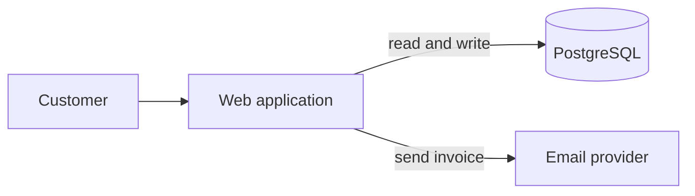
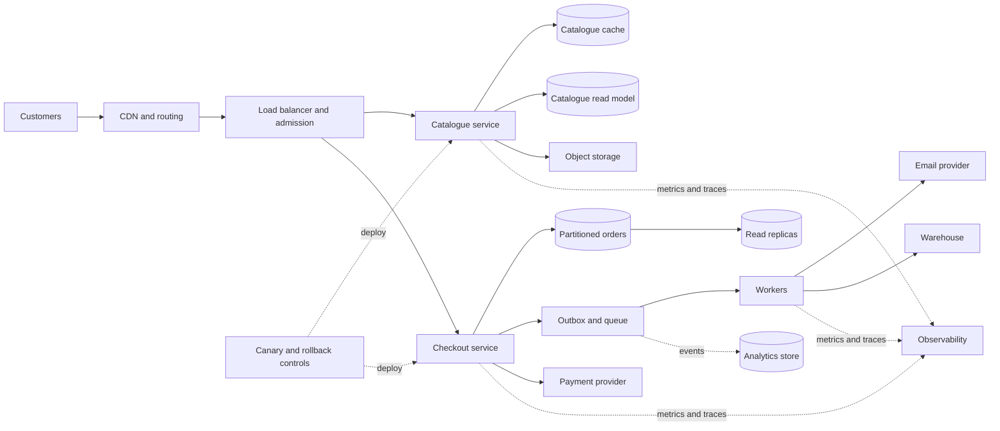

# Architecture-diagram specification

## 1. Purpose

The diagram at the top of every level is the visual memory of the workshop. It must help participants answer three questions immediately:

1. What is the current system?
2. Where does this request travel?
3. What changed after the previous decision?

The diagram must not reveal the current level’s solution before submission.

## 2. Diagram states within a level

Each level has two diagram states:

- **Current setup:** topology inherited from the previous level. This is shown during briefing, investigation, diagnosis, and decision.
- **Evolved setup:** topology after the recommended decision. This appears only during debrief and becomes the next level’s current setup.

Metric overlays may identify a stressed request path after the participant reveals relevant evidence. They must not label a component “the bottleneck” in participant mode. Facilitator mode may display the diagnostic overlay.

## 3. Fixed layout

Components occupy stable lanes and preferred coordinates:

| Lane | Components | Stable placement rule |
|---|---|---|
| Client | Users, admin users | Far left |
| Edge | CDN, routing, load balancer, rate limiter | Left-center |
| Compute | Monolith, catalogue service, checkout service, workers | Center |
| Fast state | Redis, session store, queue | Below compute |
| Transactional data | PostgreSQL primary, read replicas, partitions/shards | Right-center |
| Durable object state | Product images, generated documents, uploads | Below transactional data |
| Analytical data | Event pipeline, analytics store | Lower right |
| External | Email, payment, warehouse | Far right |
| Operations | Metrics/traces, health checks, deployment controls | A narrow lower lane, only when relevant |

When a component is added, existing components must not jump to unrelated positions. The layout may expand vertically, but the user-to-service-to-data direction remains left to right.

## 4. Visual grammar

### Nodes

| Node type | Shape and label rule |
|---|---|
| User or actor | Compact person/terminal node |
| Edge or router | Rounded rectangle |
| Application or service | Rectangle with service name and instance count |
| Database | Cylinder |
| Cache | Stacked fast-state block |
| Queue or event stream | Horizontal channel |
| Worker | Rectangle with gear icon |
| Object storage | Bucket or document-store shape with a text label |
| External dependency | Dashed-boundary rectangle |
| Observability | Small telemetry node, visually secondary |

Every node has text; icons are supplementary. Color never carries meaning alone.

### Edges

| Flow | Line style |
|---|---|
| Synchronous request | Solid arrow |
| Asynchronous job/event | Dashed arrow |
| Database read | Solid arrow labeled `read` |
| Database write | Solid arrow labeled `write` |
| Replication | Double-line or paired arrow labeled with lag |
| Analytics pipeline | Dotted arrow |
| Fallback/degraded route | Muted dashed arrow |

Edge thickness may communicate relative traffic only when a small legend states the meaning.

### State overlays

- **New this level:** short `NEW` label during debrief only
- **Changed:** subtle outline during the transition
- **Stressed path:** warning marker plus metric label
- **Unavailable:** cross-hatch or broken-link icon, not color alone
- **Degraded but serving:** explicit `DEGRADED` text
- **Source of truth:** small label on transactional ownership

## 5. Consistency rules

1. Use one diagram renderer and one component library for all levels.
2. Keep unchanged node labels, shapes, colors, and positions stable.
3. Do not show future components in a disabled state.
4. Do not show decorative infrastructure that is irrelevant to the incident.
5. Do not automatically equate service separation with database separation; ownership is labeled explicitly.
6. Show write paths and consistency boundaries whenever correctness is the lesson.
7. Show failure boundaries in Level 12 without redrawing the entire system.
8. Provide a text alternative in DOM order listing actors, nodes, and flows.
9. On narrow screens, stack lanes vertically while preserving flow order; do not require horizontal scrolling.
10. In fullscreen presentation mode, the diagram remains readable from screen sharing at 1080p.
11. Node IDs and semantic lane slots remain stable across levels even when their visible labels gain annotations.
12. The diagram model records owner, source-of-truth status, consistency expectation, and failure behavior separately from visual styling.
13. Evidence overlays may expose measured stress only after the corresponding evidence item is opened; merely changing the traffic preset must not reveal the diagnosis.

### 5.1 Responsive layouts

The desktop renderer uses stable coordinate slots. The narrow-screen renderer uses a second stable vertical template with the same node IDs and flow order; it does not algorithmically rearrange nodes on each level. Labels may wrap to two lines, but components and edge labels must not overlap at 320 px.

## 6. Architecture progression

| Level | Current setup at start | Evolved setup revealed after recommended decision |
|---:|---|---|
| 1 | User → monolithic web app → PostgreSQL; app → email provider | Same topology plus metrics/tracing node and labeled SLO observation points |
| 2 | Instrumented monolith and PostgreSQL | Same topology; app node labeled batched queries/pagination and DB labeled targeted indexes/pooling |
| 3 | Optimized monolith and PostgreSQL | Redis cache added between catalogue path and PostgreSQL; PostgreSQL remains source of truth |
| 4 | Monolith, Redis, PostgreSQL, synchronous email | Queue/outbox and workers added; invoice, analytics, and warehouse effects become asynchronous |
| 5 | One stateful app instance, cache, queue, primary database | Load balancer plus multiple stateless app instances; sessions externalized and files moved to object storage |
| 6 | Load-balanced origin | CDN/edge added before load balancer for static assets and public catalogue; private paths bypass public cache |
| 7 | CDN, app fleet, Redis, queue, one primary | Read replicas added; write and read routes labeled; read-your-own-write path remains on primary |
| 8 | Primary plus read replicas handling transactions and reports | Event/batch pipeline and analytical store added; dashboards route away from OLTP replicas |
| 9 | Shared monolith fleet for catalogue and checkout | Catalogue and checkout independently deployable; catalogue read model and order source of truth labeled. A separate physical catalogue database is not implied unless its ownership field says so |
| 10 | Separate catalogue and checkout with order database | Checkout gains admission control, idempotency, reservation state machine, and atomic inventory write path |
| 11 | Large order database | Canonical setup shows time partitions/archive only; the optional senior extension may temporarily reveal shards without changing the Level 12 starting state |
| 12 | Full evolved system | Same topology with multi-zone placement, dependency policies, backpressure, graceful-degradation routes, and health-based canary rollback controls |

## 7. Reference baseline

This Mermaid diagram is conceptual documentation. The implementation should use a fixed-coordinate responsive SVG so component positions remain stable.

After the Level 1 reveal, add `APP -. metrics and traces .-> OBS[Observability]` without moving the existing four nodes.

## 8. Reference final topology

Multi-zone placement and dependency policies are overlays on these nodes and edges, not duplicate copies of the entire diagram. Shards are absent from the canonical final topology because Level 11 Phase B is optional.

## 9. Per-level diagram acceptance test

For every level, reviewers must be able to confirm:

- The current diagram matches the previous level’s evolved state.
- The current solution is not visible before submission.
- The incident’s relevant path is visually traceable.
- The debrief adds or changes only what the recommended decision requires.
- The new component’s data ownership and failure implication are stated.
- The diagram remains legible with labels at desktop and mobile widths.
- The text alternative conveys the same architecture without the image.
- Current and evolved diagrams use the same viewport, scale, and unchanged-node coordinates at desktop size.
- Every visible node and edge can be traced to level data rather than conditional markup embedded in a UI component.
